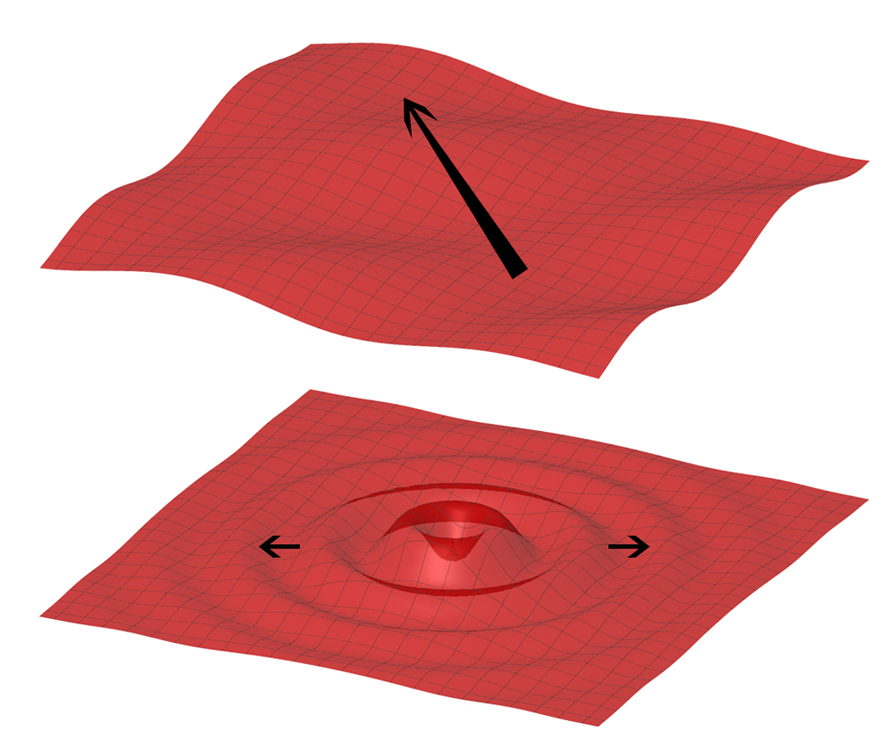
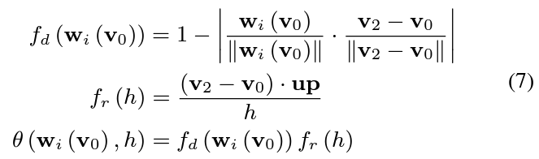
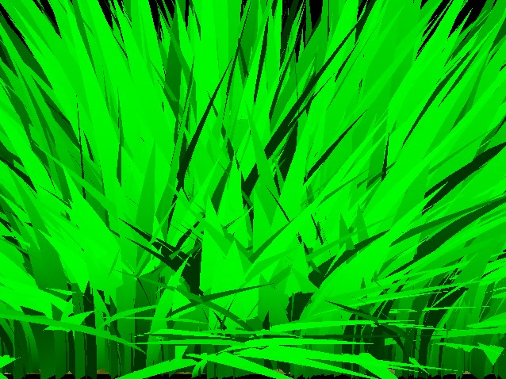
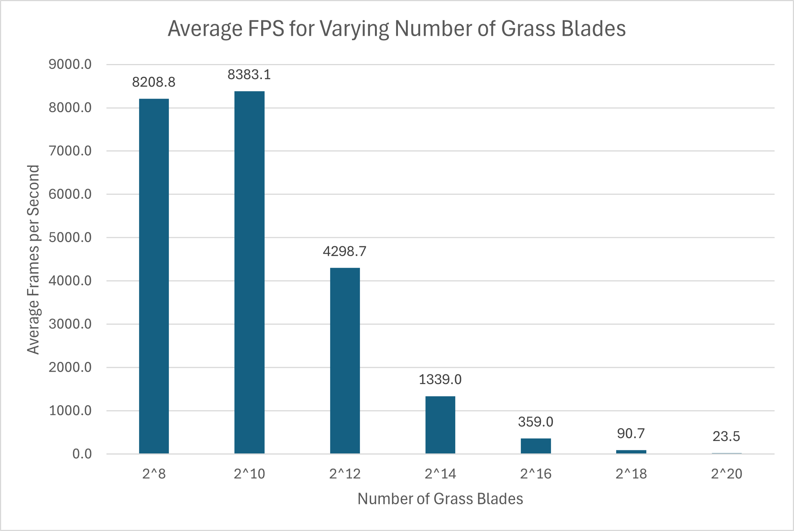
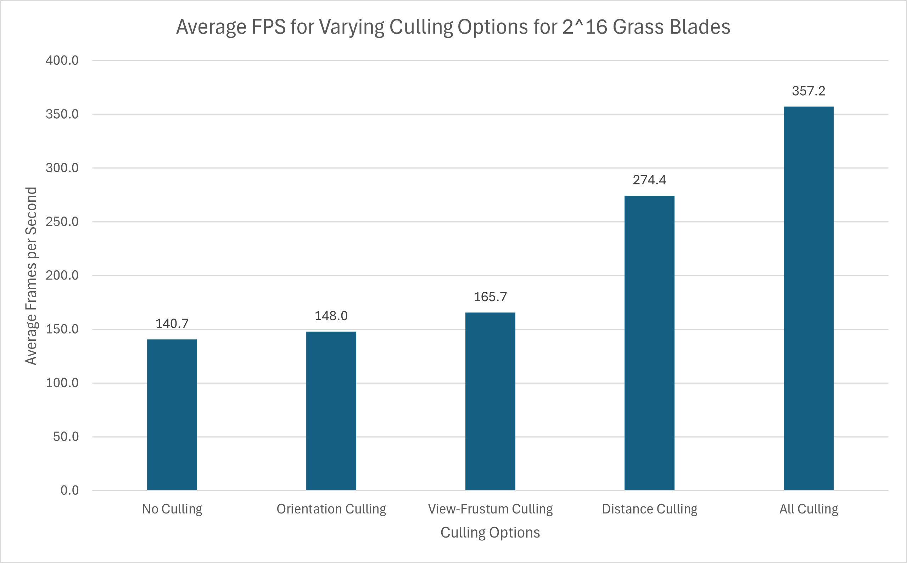
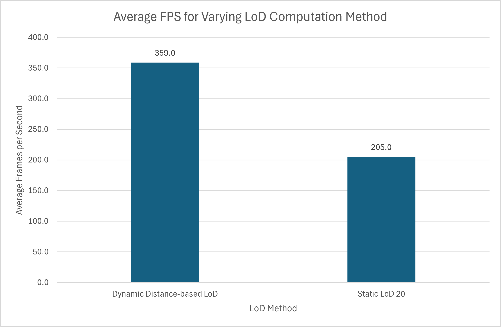

## Vulkan Grass Rendering

[](https://youtu.be/JXlazz3fjsE)
(same video also at writeup/grass.mov)

Author: Alan Lee ([LinkedIn](https://www.linkedin.com/in/soohyun-alan-lee/))

This project is a Vulkan grass renderer showcasing physically based simulation of grass blade movements under various forces and collisions.

The algorithm is based on a real-time grass rendering paper by Klemens Jahrmann and Michael Wimmer and accounts for gravity, wind, and recovery forces as well as dynamic culling for maximum performance.

## Contents

* `src/` C++/Vulkan source files.
  * `shaders/` glsl shader source files
  * `images/` images used as textures within graphics pipelines
* `external/` Includes and static libraries for 3rd party libraries.

## Running the code

The codebase requires the [Vulkan SDK](https://vulkan.lunarg.com/) and a [Vulkan driver](https://developer.nvidia.com/vulkan-driver) appropriate to your graphics card to have been installed to be ran.

Configure and generate build files using provided cmakelists.

Vulkan validation layer is turned on by default for `debug` mode, but it is not enabled in `release` mode.

## Analysis

### Grass Representation


In this project, grass blades will be represented as Bezier curves while performing physics calculations and culling operations. 

Each Bezier curve has three control points.
* `v0`: the position of the grass blade on the geomtry
* `v1`: a Bezier curve guide that is always "above" `v0` with respect to the grass blade's up vector
* `v2`: a physical guide for which we simulate forces on

We also need to store per-blade characteristics that will help us simulate and tessellate our grass blades correctly.
* `up`: the blade's up vector, which corresponds to the normal of the geometry that the grass blade resides on at `v0`
* Orientation: the orientation of the grass blade's face
* Height: the height of the grass blade
* Width: the width of the grass blade's face
* Stiffness coefficient: the stiffness of our grass blade, which will affect the force computations on our blade

We can pack all this data into four `vec4`s, such that `v0.w` holds orientation, `v1.w` holds height, `v2.w` holds width, and `up.w` holds the stiffness coefficient.

### Simulating Forces

We separate our rendering pipeline into two passes: first pass to render current form of grass blades and second pass to compute updated paramters for the next frame. Physical force simulation is performed in the second pass as a compute shader. This compute shader pass alters the control points of each grass blade according to forces being applied on them.

#### Gravity

Given a gravity direction, `D.xyz`, and the magnitude of acceleration, `D.w`, we can compute the environmental gravity in our scene as `gE = normalize(D.xyz) * D.w`.

We then determine the contribution of the gravity with respect to the front facing direction of the blade, `f`, as a term called the "front gravity". Front gravity is computed as `gF = (1/4) * ||gE|| * f`.

We can then determine the total gravity on the grass blade as `g = gE + gF`.

#### Recovery

Recovery corresponds to the counter-force that brings our grass blade back into equilibrium. This is derived in the paper using Hooke's law. In order to determine the recovery force, we need to compare the current position of `v2` to its original position before simulation started, `iv2`. At the beginning of our simulation, `v1` and `v2` are initialized to be a distance of the blade height along the `up` vector.

Once we have `iv2`, we can compute the recovery forces as `r = (iv2 - v2) * stiffness`.

#### Wind



We represent wind as an analytic function `w_i(v_0)` that outputs direction and strength of the wind influence at the position of a blade of grass. The analytic functions can be modeled heuristically using multiple sine and cosine functions with different frequencies. This can simulate wind coming from some direction or a specific source, like a helicopter or a fan.

The strength by which our blades are affected by wind should also be affected by the alignment of the grass blades to the direction of wind. That is, a grass blade facing perpendicular to the wind direction should be affected more strongly by the wind. Similarly, a grass blade standing more straight up (so greater surface area exposed) should be affected more strongly by the wind as well. These two ideas are captured by the following equations where `f_d` is the directional alignment and `f_r(h)` represents the straightnes of the blade with respect to the up vector.



Once we have a wind direction and a wind alignment term, we can compute total wind force (`w`) as `w_i(v_0) * windAlignment`.

### Culling tests

Although we need to simulate forces on every grass blade at every frame, there are many blades that we won't need to render due to a variety of reasons. Here are some heuristics we implement in this project to cull blades that won't contribute positively to a given frame.

#### Orientation culling

Consider the scenario in which the front face direction of the grass blade is perpendicular to the view vector. Since our grass blades won't have width, we will end up trying to render parts of the grass that are actually smaller than the size of a pixel. This could lead to aliasing artifacts. In order to remedy this, we cull these blades by performing a dot product test to see if the view vector and front face direction of the blade are perpendicular.

#### View-frustum culling

We also want to cull blades that are outside of the view-frustum, considering they won't show up in the frame anyway. To determine if a grass blade is in the view-frustum, we want to compare the visibility of three points: `v0, v2, and m`, where `m = (1/4)v0 * (1/2)v1 * (1/4)v2`.

If all three points are outside of the view-frustum, we cull the grass blade. The paper uses a tolerance value for this test so that we are culling blades a little more conservatively. This can help with cases in which the Bezier curve is technically not visible, but we might be able to see the blade if we consider its width. The default tolerance for this project is `0.3`.

#### Distance culling

Similarly to orientation culling, we can end up with grass blades that at large distances are smaller than the size of a pixel. This could lead to additional artifacts in our renders. In this case, we can cull grass blades as a function of their distance from the camera.

We define an arbitrary max distance from camera and divide the range from camera do this max distance plane into 10 buckets. We firstly find the bucket index `d` of each grass blade based on its distance from camera, and then for every 10 grass blades, we cull all blades such that `bladeIndex % 10 < d`.

### Performance

* Tested on: Windows 10, AMD Ryzen 5 5600X 6-Core Processor @ 3.70GHz, 32GB RAM, NVIDIA GeForce RTX 3070 Ti (Personal Computer)
* Render resolution 640 x 480
* Number of grass blades 2^16 unless otherwise noted
* Default camera position and view



We use `VK_LAYER_LUNARG_monitor` layer to measure FPS. For each tested method, 20 FPS measurements were made and averaged to produce a single performance metric. Raw data can be found at `writeup/rawdata.xlsx`.
> ```cpp
> Instance::Instance(const char* applicationName, unsigned int additionalExtensionCount, > const char** additionalExtensions) {
>     ...
>     const char* instance_layers[] = { "VK_LAYER_LUNARG_monitor" };
>     createInfo.enabledLayerCount = 1;
>     createInfo.ppEnabledLayerNames = instance_layers;
>     ...
> }
> ```

#### Varying Number of Grass Blades



We can immediately see that for high number of grass blades (2^12 and above), our algorithm approximately scales linearly FPS-wise with the number of grass blades. That is, as the number of grass blades increase by 4x each time, the average FPS is decreased by approximately 4x as well. This shows the scalability and effectiveness of our grass representation and culling approach.

Another interesting observation to be made is not having this trend with small number of grass blades (2^8 and 2^10). This may be due to the fact that these number of grass blades is so low that we are reaching physical limitations of memory bandwidth and graphics pipeline state changes. Recall that each frame as reported by the monitoring layer includes both compute shader and rendering pipelines, so a reported average of 8000+ FPS means more than 8000 iterations of the command queue executions and relevant memory transfers. This limitation is currently a speculation, but future works involving more detailed profiling with tools such as Nvidia Insight may prove or disprove this conjecture.

#### Varying Culling Options



We can observe here the effectiveness of each culling method for our specific testing setup. We see that the orientation culling improve performance by **5.2%**, the view-frustum culling by **17.8%**, the distance calling by **95.2%**, and all culling methods combined by **153.9%**.

The orientation culling not getting much performance boost is somewhat expected as all grass blades are initialized to a random direction vector. This means that there is a 10% chance (as our threshold is 0.9 for degree of orientation alignment) in a purely random grass generation algorithm that a grass will fit the culling criteria. Performance gain of 5.2% in that sense is a reasonable result.

The default camera view most definitely does not include the entirety of the scene in its view frustum. The exact proportion of the scene that is outside of the tolerance of our view-frustum culling heuristic is hard to compute, but this culled scene structure is most likely no less than 15%. For this, performance gain of 17.8% is also a reasonable result.

The distance culling provides the most dramatic increase in performance. Undoubtedly, not drawing at all is the cheapest drawing operation we can have. Assuming completely even distribution of grass blades across our distance clamping range, we know that in expectation we will cull 50% of all of our grass blades, as the percentage of blades culled is inversely proportional to the bucket approximation of the distance from camera. Therefore, 50% culling of grass blades should result in approximately double the performance, which is practically equivalent to our 95.2% performance gain.

It is interesting to note that the overall performance gain of all culling methods combined is greater than compounding of each culling method. We speculate that this may be due to the fact that the blades culled by each methodology are distinct so we get full benefits of compounding culling as well as such compounding improvements being transferred to rendering pipeline efficiencies as well. However, more investigation should follow to better identify why this may be the case.

#### Varying Tessellation Level based on Distance

For a more dynamic and effective rendering of grass blade, we differ the level of tessellation based on the distance from camera. We convert the input grass blade position `v0` into camera view space, clamp its distance from camera to arbitrary near and far planes, and linearly interpolate the level of detail for tessellation between 20 (closest) and 4 (farthest). This interpolated level of detail is then truncated to integer and used as our actual inner and outer tessellation levels in the tessellation control shader.



Since we do not want to compromise on the quality of the closest grass blades as their appearance is the most visible to us and determines our impression of the effectiveness of our rendering, we compared dynamic LoD computation scheme described above to statically setting tessellation level to 20 for all grass blades. We can observe **75.1%** performance gain with dynamic distance-based LoD scheme. This improvement matches our expectation as the scene is constructed to have grass blades evenly distributed throughout the entire depth range, so a lot of grass blades are guaranteed to be cheaper to tessellate and render.

## Credits

- [Responsive Real-Time Grass Rendering for General 3D Scenes](https://www.cg.tuwien.ac.at/research/publications/2017/JAHRMANN-2017-RRTG/JAHRMANN-2017-RRTG-draft.pdf)
